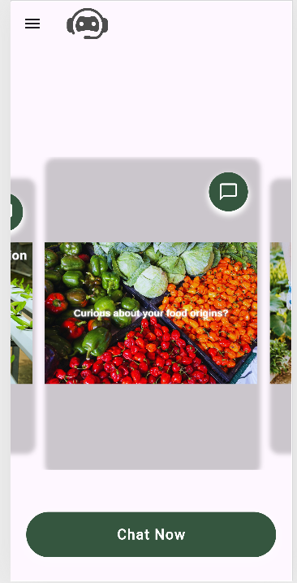
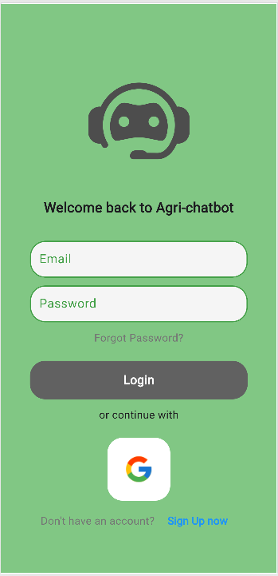

# 🤖 AI Chatbot  

A conversational AI chatbot built with **Flutter** and **Firebase**, powered by **Google Gemini API**. The chatbot provides intelligent responses, supports markdown formatting (including italics and bold text), and offers a smooth user experience with real-time messaging.  

## ✨ Features  
✅ **Sign up and Log-in**- Users can create accounts on the platform
✅ **Guest account**- Users can also opt to not create accounts on the platform
✅ **AI-Powered Conversations** – Uses Google Gemini API to generate responses 
✅ **Image carousel**- Clean UI with dynamic image carousel linked to the ai for automated messages 
✅ **Markdown Support** – Properly formats text with bold, italics, and code snippets  
✅ **User Authentication** – Allows logged-in users to save chat history  
✅ **Avatar & UI Enhancements** – Displays user avatars and a side menu for previous chats  
✅ **Guest Mode** – Users can chat without logging in, but chats won't be saved  
✅ **Firebase Firestore** – Stores messages securely (with authentication-based access)  
✅ **Remote Config Integration** – Fetches API keys dynamically  

## 📸 Screenshots  

 
 



## 🚀 Getting Started  

### **1️⃣ Prerequisites**  
- Install [Flutter](https://flutter.dev/docs/get-started/install)  
- Create a Firebase project and enable Firestore, Authentication, and Remote Config  

### **2️⃣ Setup**  
1. Clone the repo:  
   ```bash
   git clone https://github.com/yourusername/chatbot.git
   cd chatbot
   ```
2. Install dependencies:  
   ```bash
   flutter pub get
   ```
3. Add Firebase credentials:  
   - Download `google-services.json` (for Android) and `GoogleService-Info.plist` (for iOS)  
   - Place them in the respective `android/app/` and `ios/Runner/` directories  

4. Configure **Remote Config**:  
   - Go to Firebase > Remote Config  
   - Add a key: `GEMINI_API_KEY` with your API value  

5. Run the app:  
   ```bash
   flutter run
   ```
## 📜 License  
MIT License – Free to use and modify!  
